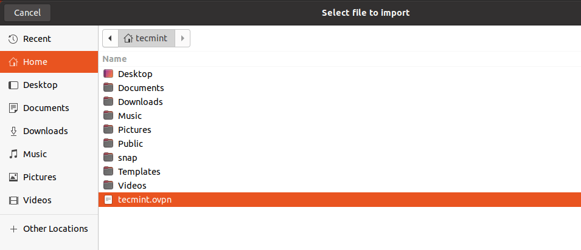

# Setup OpenVPN Clients in Ubuntu
8. Now its time to set up your OpenVPN client and connect it to the VPN server. First, install the OpenVPN package in the client machine as follows.
```
sudo apt install openvpn
```
9. On a desktop system, you also need to install the network-manager-openvpn package to make VPN settings from the graphical interface.
```
sudo apt install network-manager-openvpn
```
10. After installing the above packages, start the OpenVPN service, for now, enable it to automatically start at system boot and check its status to confirm that it’s up and running.
```
 sudo systemctl start openvpn 
 ```
```
 sudo systemctl enable openvpn 
 ```
 ```
 sudo systemctl status openvpn 
```
11. Now you need to import the OpenVPN client settings from the OpenVPN server. Open a terminal window and use the SCP command to grab the file as shown.
```
 cd ~
 ```
 ```
scp rana@10.42.0.247:/home/rana/ranavpn.ovpn .
```
12. Open system Settings, then go to Networks. Under VPN, click the add button to get the necessary options.

13. In the pop-up window, choose `“Import from file”` as highlighted in the following screenshot. Then browse your file manager and select the `.ovpn`client config file you downloaded from the server.


Import VPN Settings



14. On other Linux desktop systems, click on the network icon on the system panel, go to Network Connections. Then click the plus button to add a new connection. From the drop, select “Import a saved VPN configuration…” as highlighted in the following screenshot.

Create the connection and import the file.


15. After importing the file, the VPN settings should be added as shown in the following screenshot. Then click Add.


16. Your VPN client settings should be added successfully. You can connect to the OpenVPN server by turning on the VPN as highlighted in the following screenshot.


17. Now the VPN connection should be established successfully as shown in the following screenshot.


18. If you check your network interface connections using the IP add command, there should now exist a VPN tunnel interface as highlighted in the following screenshot.

```
ip ad
```
